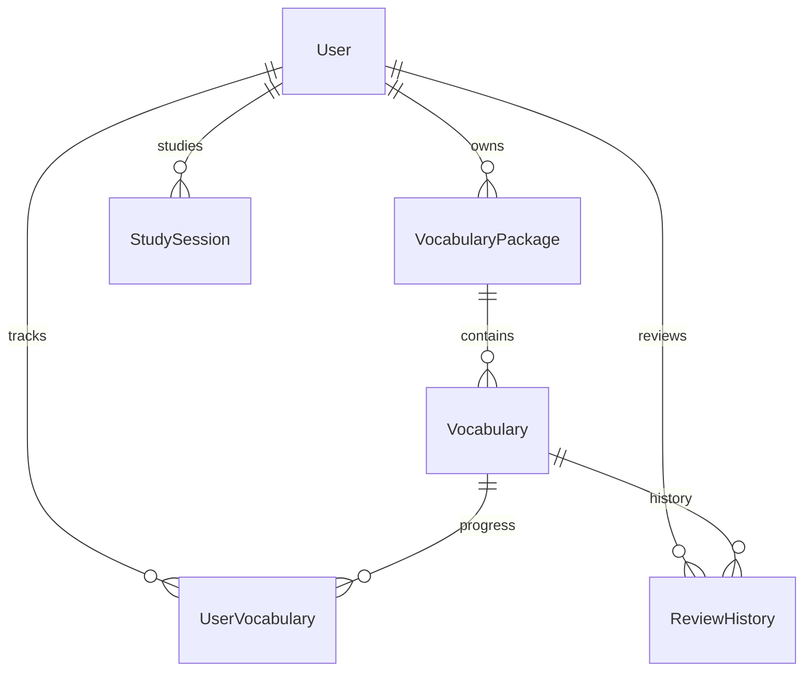

# Database

Source of truth:

- Prisma schema: `prisma/schema.prisma`
- Reset seed: `src/scripts/seed.js`
- Seed command: `npm run db:seed`
- App tables: `User`, `VocabularyPackage`, `Vocabulary`, `UserVocabulary`, `StudySession`, `ReviewHistory`

## ERD



## Enums

`PackageVisibility`

- `system`: default packages, no owner.
- `public`: user-owned package visible to everyone.
- `private`: user-owned package visible only to owner.

## Tables

### User

Stores the application user linked from Firebase.

| Column | Type | Notes |
| --- | --- | --- |
| `id` | `String` | Primary key, UUID default. |
| `firebaseUid` | `String?` | Unique. Null is allowed so seeded users can link on first Firebase login. |
| `email` | `String` | Unique. |
| `name` | `String?` | Display name. |
| `streak` | `Int` | Default `0`, non-negative. |
| `targetWeekly` | `Int` | Default `80`, non-negative. |
| `createdAt` | `DateTime` | Default `now()`. |
| `updatedAt` | `DateTime` | Auto-updated. |

Relations:

- Owns many `VocabularyPackage`.
- Has many `UserVocabulary`, `StudySession`, `ReviewHistory`.

### VocabularyPackage

Groups vocabulary into system, public, or private packages.

| Column | Type | Notes |
| --- | --- | --- |
| `id` | `String` | Primary key, UUID default. |
| `title` | `String` | Package title. |
| `description` | `String?` | Optional description. |
| `level` | `String` | Default `All Levels`. |
| `isPro` | `Boolean` | Default `false`. |
| `ownerId` | `String?` | FK to `User.id`. Null only for `system`. |
| `visibility` | `PackageVisibility` | Default `system`. |
| `createdAt` | `DateTime` | Default `now()`. |
| `updatedAt` | `DateTime` | Auto-updated. |

Rules:

- `system` packages must have `ownerId = null`.
- `public` and `private` packages must have an owner.
- Deleting owner cascades owned packages.
- Indexed by `ownerId` and `visibility`.

### Vocabulary

Stores each word and its language metadata.

| Column | Type | Notes |
| --- | --- | --- |
| `id` | `String` | Primary key, UUID default. |
| `word` | `String` | English word. |
| `meaning` | `String` | Vietnamese meaning, currently stored as text. |
| `ipa` | `String?` | Optional pronunciation. |
| `example` | `String?` | Optional example sentence. |
| `partOfSpeech` | `String?` | Example: noun, verb, adjective. |
| `synonyms` | `String[]` | Default empty array. |
| `packageId` | `String?` | FK to `VocabularyPackage.id`; null means loose/global word. |
| `createdAt` | `DateTime` | Default `now()`. |
| `updatedAt` | `DateTime` | Auto-updated. |

Rules:

- Deleting a package cascades its words.
- Unique per package by normalized word: `packageId + lower(trim(word))`.
- Indexed by `packageId` and `partOfSpeech`.

### UserVocabulary

Tracks one user's SRS progress for one vocabulary item.

| Column | Type | Notes |
| --- | --- | --- |
| `id` | `String` | Primary key, UUID default. |
| `userId` | `String` | FK to `User.id`. |
| `vocabularyId` | `String` | FK to `Vocabulary.id`. |
| `level` | `Int` | SRS level, `1..6`. |
| `nextReview` | `DateTime` | When the word is due. |
| `createdAt` | `DateTime` | Default `now()`. |
| `updatedAt` | `DateTime` | Auto-updated. |

Rules:

- Unique: one progress row per `(userId, vocabularyId)`.
- Indexed by `(userId, nextReview)` for review queue.
- Deleting user or word cascades progress.

### StudySession

Stores study activity for dashboard and streaks.

| Column | Type | Notes |
| --- | --- | --- |
| `id` | `String` | Primary key, UUID default. |
| `userId` | `String` | FK to `User.id`. |
| `date` | `DateTime` | Default `now()`. |
| `durationMinutes` | `Int` | Default `0`, non-negative. |
| `wordsLearned` | `Int` | New words first learned in this session. Review/practice sessions store `0`. Default `0`, non-negative. |

Rules:

- Indexed by `(userId, date)`.
- Deleting user cascades sessions.

### ReviewHistory

Stores each review event.

| Column | Type | Notes |
| --- | --- | --- |
| `id` | `String` | Primary key, UUID default. |
| `userId` | `String` | FK to `User.id`. |
| `vocabularyId` | `String` | FK to `Vocabulary.id`. |
| `reviewedAt` | `DateTime` | Default `now()`. |
| `isCorrect` | `Boolean` | Final correct/incorrect value. |
| `previousLevel` | `Int` | Range `0..6`. |
| `newLevel` | `Int` | Range `1..6`. |

Rules:

- Indexed by `(userId, reviewedAt)` for schedule/history views.
- Indexed by `vocabularyId`.
- Deleting user or word cascades history.

## Access Rules

Application code uses these package visibility rules:

```js
OR: [
  { visibility: 'system' },
  { visibility: 'public' },
  { ownerId: userId },
]
```

Vocabulary access follows package access. Loose words with `packageId = null` are globally accessible.

## Supabase Security

The app uses backend Prisma direct database access.

Migration `20260706000000_harden_learning_schema` enables RLS on all app tables and revokes direct table privileges from Supabase `anon` and `authenticated` roles. The frontend should keep using the Express backend API, not direct Supabase Data API calls.

## Seed Data

Run:

```bash
cd backend
npm run db:seed
```

The seed script truncates app tables and recreates a complete test dataset.

Main test user:

| Field | Value |
| --- | --- |
| `email` | `havanphong784@gmail.com` |
| `firebaseUid` | `null` |
| `name` | `Ha Van Phong` |
| `streak` | `6` |
| `targetWeekly` | `80` |

Seed counts after reset:

| Table | Count |
| --- | ---: |
| `User` | 2 |
| `VocabularyPackage` | 7 |
| `Vocabulary` | 42 |
| `UserVocabulary` | 15 |
| `StudySession` | 8 |
| `ReviewHistory` | 10 |

Package cases:

| Package | Visibility | Owner | Purpose |
| --- | --- | --- | --- |
| `System Starter B1` | `system` | none | Default visible package. |
| `System IELTS Advanced` | `system` | none | Pro package case. |
| `Phong Public Travel` | `public` | main user | Public owned package. |
| `Phong Private Mistakes` | `private` | main user | Private owned package. |
| `Empty Private Sandbox` | `private` | main user | Empty package state. |
| `Other User Public` | `public` | other user | Public package from another user. |
| `Other User Private Hidden` | `private` | other user | Hidden package access test. |

Progress cases:

- Levels `1..6` are all present.
- `nextReview` includes overdue, due today, and future dates.
- Main user has 8 due reviews after seed.
- One loose/global word is included in progress.

Review history cases:

- Includes correct and incorrect answers.
- Includes level movement up, down, and unchanged.

## Migration Notes

Current migration chain:

- `20260702000000_init_schema`: baseline app schema.
- `20260703000000_add_package_ownership`: package ownership/visibility migration.
- `20260706000000_harden_learning_schema`: enum hardening, constraints, indexes, RLS, duplicate cleanup.
- `20260707000000_drop_review_rating`: removes four-button review ratings and keeps reviews boolean-only.

Check status:

```bash
cd backend
npx prisma migrate status
```
